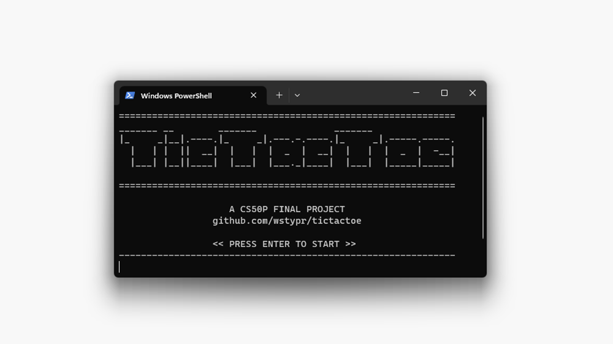
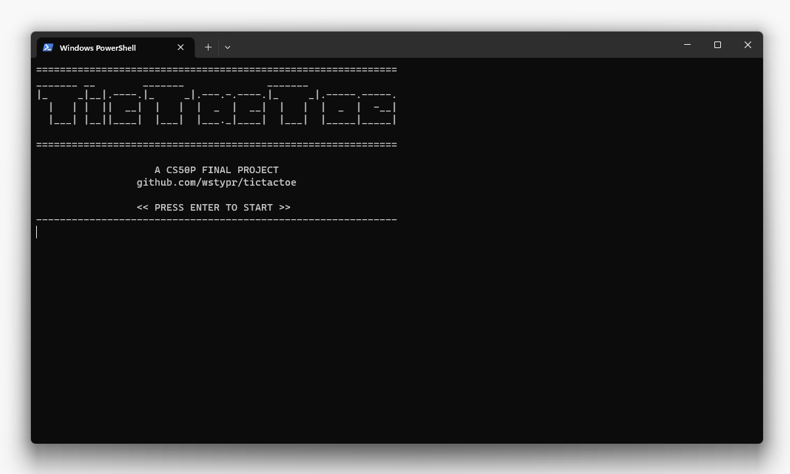
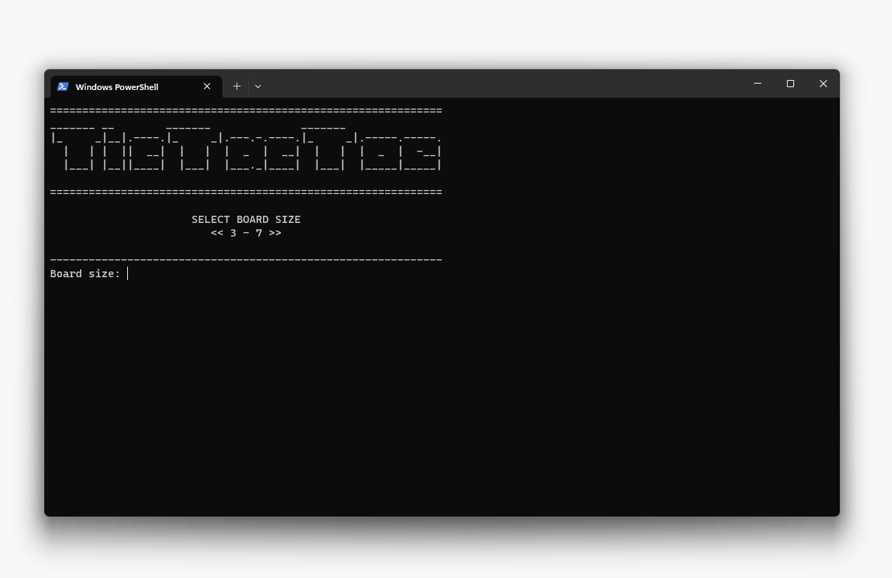
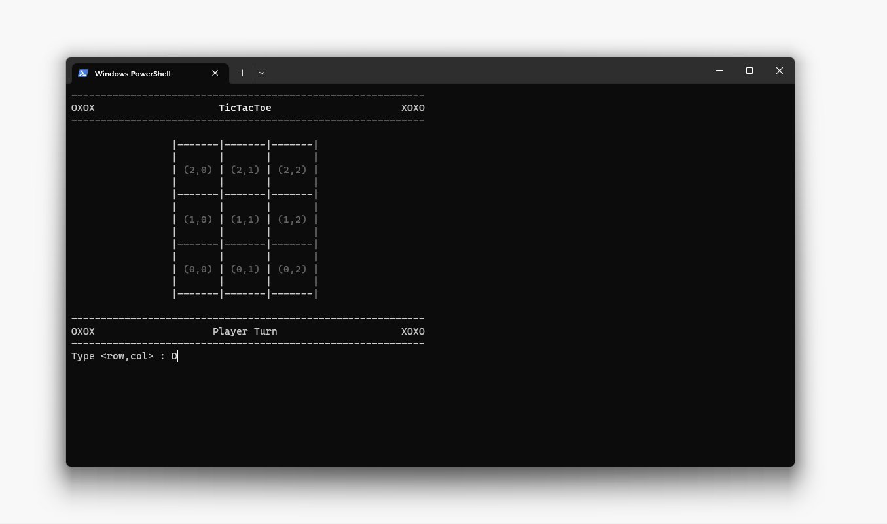
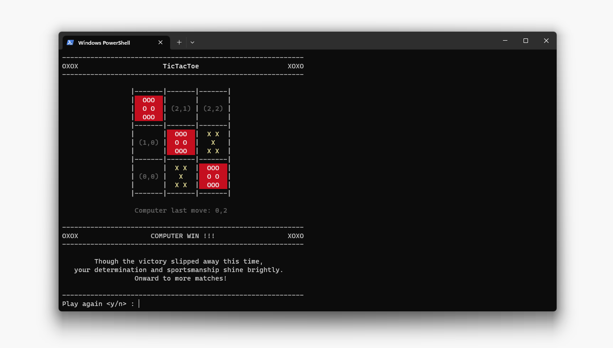

# TicTacToe

## CS50P FINAL PROJECT

### by WSTYPR

#### Video Demo

https://youtu.be/bodQODmQ8Ow

#### Description

TicTacToe is a python game running on terminal. It could be single player (versus computer) or multiplayer (player versus player).

Each player tries to win by form a straight Os or Xs vertically, horizontally, or diagonally.

When a player successfully form a straight line, the line will be highlighted and a congratulation message will appear.

Basically a tictactoe game as you all know.

#### How To Play

##### Install

Clone and extract the repo on your local machine.

run `pip install -r requirement.txt` to install the required python package. (It only requires pyfiglet btw)

Then start the game by run `python project.py`

##### Splash Screen

The splash screen will appear. From this, the game is basically self explained. It is designed to be intuitive and player will understand without any further guide.

But, let's do the walktrough anyway.

##### Board Size

The code basically can handle any positive number, but it is limited to 7 for aesthetic reason. Because it run on terminal. the board will break if it too wide. So max 7, it is.

Type the size of your choice from 3 to 7 then press enter.

Don't worry, there is handling mechanism for any invalid input.

###### Mode Selection

There are 3 mode selections available:

1. Player vs Player
1. Player vs Computer
1. Computer vs Player

There is some alghoritms run behind the computer, so it won't just pick a random box. Try to beat it if you can. I, my self, as the designer of the algorithm can only get draw at best when against the computer on more than 3x3 board.

##### Gameplay

pick a move/box by typing `row,col` eg: `0,1` to pick row 0 and column 1.

There is the box id inside each box, so you won't get lost.

or another way, you can just type rowcol directly without comma such as `20` to pick box row 2 and col 0.

Try to form a straight Xs or Os to win the game.

when a player successfully form a straight line, the line will be highlighted, congratulation message will appear and play-again prompt appear.

type y/yes to play again, type n/no to quit the game.

#### Technical Stuff

This game make use of ANSII Escape Code for styling such as color, highlight and text bold/dim. So, it'll break if your terminal doesn't support ANSII Escape Code. But almost all terminal nowadays support ANSII Escape Code.

It heavily makes use of python OOP paradigm, each box is an object, the board itself is an object which consist of boxes according to the size chosen by the player. The player also an object.

The board styling is inside the Board class. Also there is a GameScreen class for regulating/rendering the board, message, and error display. The main project code is not bloated because every functionality is written in each corresponding class.

The Player class tracks the winning possibility. Meaning: if a player chose box 1,1, the player will have a collection of winning pattern which 1,1 is inside of them. But when the opponent choose a box, eg: 1,2. The winning pattern which includes box 1,2 will be removed.

This data is crucial for the computer player algorithm. The computer algorithm looks at its own possibility of winning combined by the remaining winning pattern that not yet taken by the player and chose a box which has the most winning possibility.

#### Easter Egg

There is an easter egg if you can beat the computer on 7x7 board. haha
